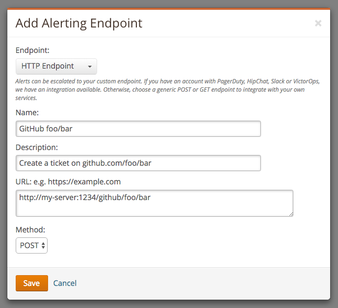

loggly-github
=============
Create GitHub tickets for Loggly alerts.

[](https://travis-ci.org/cargomedia/loggly-github)
[](https://www.npmjs.com/package/loggly-github)

*loggly-github* starts an HTTP server where Loggly can send [alert postbacks](https://www.loggly.com/docs/alert-endpoints/) to.
For each new alert it will open a GitHub ticket (if there's not already an open ticket for that alert).


Installation & Configuration
----------------------------
### Install with npm
```
npm install -g loggly-github
```

### Create a configuration file
```json
{
  "port": "<HTTP port to listen on>",
  "secret": "<Any alphanumeric API secret>",
  "github": {
    "token": "<GitHub access token>"
  }
}
```
When generating a [*personal access token*](https://github.com/settings/tokens) on GitHub, make sure to enable the "repo" scope.

### Start the server
```sh
loggly-github --config <path-to-config-file>
```

### Create a new *alerting endpoint* in Loggly
Configure the endpoint in *Loggly* to send a POST request to the *loggly-github* server:
```
http://my-server:1234/<secret>/github/<github-user>/<github-repo>?assignee=<assignee>
```
- **`secret`** (required): The *secret* as defined in your configuration
- **`github-user`/`github-repo`** (required): GitHub repo where the ticket is created
- **`assignee`** (optional): GitHub user to assign the ticket to




Development
-----------
Install dependencies:
```
npm install
```

Run tests:
```
npm test
```

Release a new version:

1. Bump the version in `package.json`, merge to *master*.
2. Push a new tag to *master*.
3. Travis will deploy to NPM.
